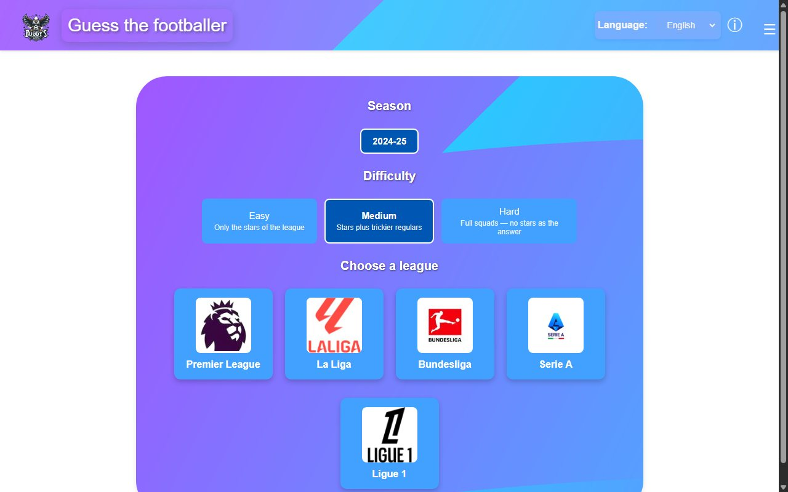

# ⚽ Bogdy's Games — Guess the Footballer

[](https://bogdandumitrascu04.github.io/Guessthefootballer/)

**🎮 Play now: [bogdandumitrascu04.github.io/Guessthefootballer](https://bogdandumitrascu04.github.io/Guessthefootballer/)** — no install needed.

A small platform of browser games built entirely with **vanilla JavaScript, HTML and CSS** — no frameworks, no build step. The first game is **Guess the Footballer**, a Wordle-style deduction game: pick a league, a season and a difficulty, then find the hidden player in at most 10 guesses.


## Guess the Footballer

1. Choose a **league**, a **season** and a **difficulty**.
2. Type a player's name — an autocomplete list with photos and club badges helps you search.
3. After each guess, a comparison card shows how close you are:
   - 🟩 **Green** — the attribute (team, position, age, shirt number, nationality) matches the hidden player.
   - **↑ / ↓ arrows** — whether the hidden player's age or shirt number is higher or lower than your guess.
4. Stuck? The **Show Hint** button progressively reveals the club, then the age.
5. Guess the player within 10 attempts to win.




### Difficulty modes

Every player in the database has a curated **tier**: 1 = league star, 2 = regular starter, 3 = deep squad.

| Mode | The hidden player is… |
|------|------------------------|
| 🟢 Easy | one of the **stars** of the league (tier 1) |
| 🟡 Medium | a star or a trickier regular (tiers 1–2) |
| 🔴 Hard | **never a star** — regulars and deep-squad players only (tiers 2–3) |

### Leagues (season 2024/25)

| League | Players | Clubs |
|--------|---------|-------|
| Premier League | 275 | 20 |
| La Liga | 191 | 20 |
| Bundesliga | 203 | 18 |
| Serie A | 292 | 20 |
| Ligue 1 | 225 | 18 |

**1,186 hand-curated players** in total. Squad data is curated from public sources (Transfermarkt, official club sites).

## Features

- **Wordle-style attribute feedback** on every guess
- **Three difficulty modes** driven by per-player tiers
- **Season selection** — new seasons are added as plain JSON files, zero code changes
- **Autocomplete search** with player photos and club badges
- **Progressive hint system** (club → age)
- **4 languages** — English, Spanish, French and Romanian, switchable live; choice persists between visits
- **Fully static** — one game engine + JSON data, runs on any static file server

## Architecture

One parameterized engine replaces the old copy-per-league code. League and season data live in versioned JSON files — adding the 2025/26 season means dropping new files into `data/seasons/2025-26/` and listing them in the manifest.

```
├── index.html                     # Platform hub — pick a game
├── games/
│   └── guess-the-footballer/
│       ├── index.html             # League / season / difficulty picker
│       ├── game.html              # game.html?league=…&season=…&difficulty=…
│       ├── engine.js              # All game logic, one copy
│       ├── i18n.js                # EN / ES / FR / RO dictionaries
│       └── game.css               # Theming via a --league-bg CSS variable
├── data/
│   ├── manifest.json              # Available leagues and seasons
│   └── seasons/2024-25/           # One JSON per league (players + tiers)
├── images/                        # Club badges and player photos
└── screenshots/
```

## Run it locally

You can [play it online](https://bogdandumitrascu04.github.io/Guessthefootballer/) without installing anything. To run it locally, serve the folder over HTTP (player data and the cookie banner are loaded with `fetch()`, so opening files directly from disk won't work):

```bash
git clone https://github.com/BogdanDumitrascu04/Guessthefootballer.git
cd Guessthefootballer

python -m http.server 8000
# or: npx serve -l 8000
```

Then open <http://localhost:8000> in your browser.

## Roadmap

- Season **2025/26** data
- **Icons mode** — guess legendary players, possibly from their silhouette
- **Daily challenge** — the same hidden player for everyone, with streaks
- **Share result** button (emoji grid, spoiler-free)
- Per-league statistics and more games on the platform

## Author

**Bogdan Dumitrascu** — [GitHub](https://github.com/BogdanDumitrascu04)
