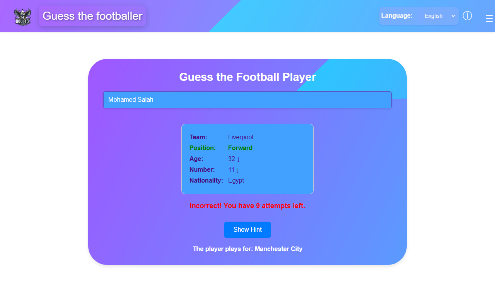
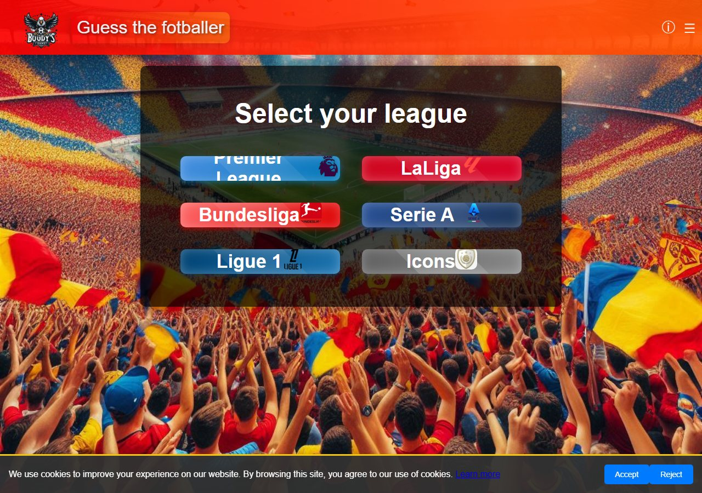
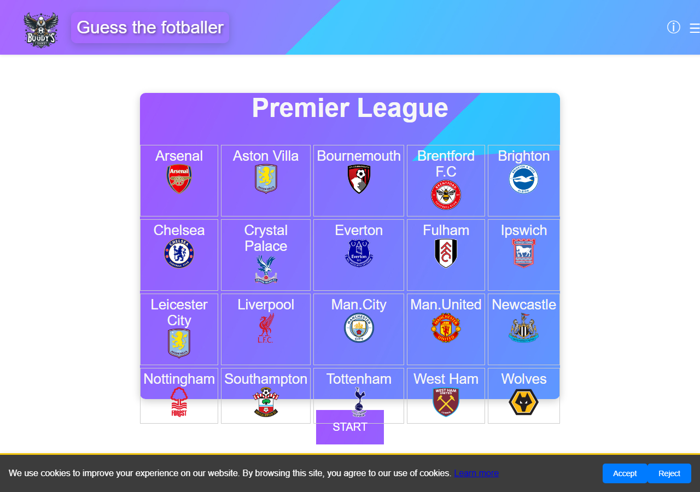

# ⚽ Guess the Footballer

A browser-based football guessing game inspired by Wordle-style deduction games. Pick a league, then identify the hidden footballer in at most 10 attempts — after every guess the game compares your player's attributes with the target's and tells you how close you are.

Built entirely with **vanilla JavaScript, HTML and CSS** — no frameworks, no build step.



## How it works

1. Choose a league from the home screen.
2. Type a player's name — an autocomplete list with player photos and club badges helps you search.
3. After each guess, the game reveals a comparison card:
   - 🟩 **Green** — the attribute (team, position, age, shirt number, nationality) matches the target player.
   - **↑ / ↓ arrows** — tells you whether the target's age or shirt number is higher or lower than your guess.
4. Stuck? The **Show Hint** button progressively reveals the target's club, then his age.
5. Guess the player within 10 attempts to win.

## Features

- **Wordle-style attribute feedback** — team, position, age, shirt number and nationality compared on every guess
- **Autocomplete search** with player photos and club logos
- **Progressive hint system** (club → age)
- **4 languages** — English, Spanish, French and Romanian, switchable live from the header
- **460+ hand-curated players** with photos and club badges
- **Cookie consent banner** and privacy policy page
- **Fully static** — plain HTML/CSS/JS, runs on any static file server

## Game modes

| Mode | Status |
|------|--------|
| Premier League | ✅ Playable — 275 players, all 20 clubs |
| La Liga | ✅ Playable — 191 players |
| Bundesliga | 🚧 In progress |
| Serie A | 🚧 Planned |
| Ligue 1 | 🚧 Planned |
| Icons (legends) | 🚧 Planned |

## Screenshots

| Home — league selection | Team roster |
|---|---|
|  |  |

## Run it locally

The game is a static site, but it must be served over HTTP (some pages use absolute asset paths and `fetch()` for the cookie banner), so opening `index.html` directly from disk won't work.

```bash
git clone https://github.com/BogdanDumitrascu04/Guessthefootballer.git
cd Guessthefootballer

# serve with any static file server, e.g.:
python -m http.server 8000
# or: npx serve -l 8000
```

Then open <http://localhost:8000> in your browser.

## Tech stack

- **JavaScript (ES6)** — game logic, autocomplete, i18n, DOM manipulation; no frameworks or libraries
- **HTML5 / CSS3** — responsive layout, gradients, custom styling per league
- **No backend** — player databases are plain JavaScript arrays, one per league

## Project structure

```
├── index.html            # Home page — league selection
├── <League>.html         # Club roster page for each league
├── <League>Game.html     # Guessing game for each league
├── js/                   # Game logic, UI scripts, translations
├── css/                  # Stylesheets
├── images/               # Club logos and player photos
└── screenshots/          # README screenshots
```

## Author

**Bogdan Dumitrascu** — [GitHub](https://github.com/BogdanDumitrascu04)
